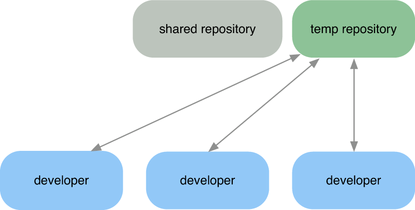
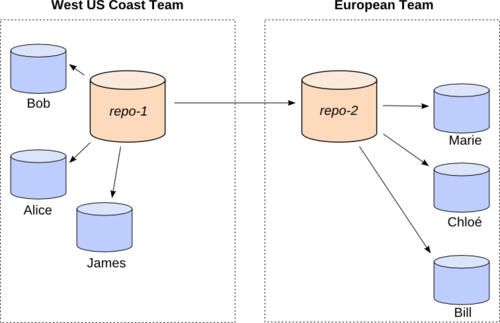

!SLIDE subsection

# DVCS

!SLIDE

# Historique

### SCCS - 1972
### RCS - 1982
### CVS - 1986
### Bitkeeper - 2001
### GNU Arch - 2001
### Darcs - 2002
### SVN - 2002
### Monotone - 2003
### Git - 2005
### Mercurial - 2005
### Bazaar - 2007

!SLIDE

# Difficile au 1er abord

!SLIDE center

!SLIDE center

!SLIDE

# Ce qui m&#39;a donné envie de migrer...

!SLIDE

# Workflow**S**

!SLIDE bullets incremental

# Vous avez maintenant à votre disposition **3** workflows

* Personnel
* Inter personnel
* Organisationnel

!SLIDE 

# Workflow organisationnel
## La méthode de travail de l&#39;organisation

!SLIDE center

## Exemple de workflow

!SLIDE center

## Exemple de workflow

!SLIDE center

## Exemple de workflow

!SLIDE center

## Exemple de workflow

!SLIDE center

## Exemple de workflow

!SLIDE 

# Workflow personnel
## La méthode de travail du développeur

!SLIDE bullets

# Choix de la fréquence

* Commit often
* Commit par fonctionnalité

!SLIDE bullets

# Choix dans la méthode

* Par patch
* 1 dépôt / branche par fonctionnalité
* 1 dépôt / branche d&#39;intégration

!SLIDE

# Workflow inter-personnel
## La méthode de travail entre développeurs

!SLIDE bullets

# Exemples :

* Sur le dépôt d&#39;un développeur
* Sur un dépôt central
* Dépôt temporaire (sandbox)
* Echange de patch / bundle
* Cherrypicking

!SLIDE bullets incremental
# Exemples de workflows mélangés

* Soucis de « micro-merge » permanent
* Corriger un bug dans un projet libre qui utilise SVN

!SLIDE 

# 
Bénéfices ?

!SLIDE 

# Souplesse & adaptation

!SLIDE 

# Développeurs focalisés sur leur code

!SLIDE 

# Envoi de code par ensemble fonctionnel

!SLIDE 

# Revue de code

!SLIDE 

# Phase de démo avant intégration

!SLIDE 

# Moins de stress !

!SLIDE 

# Projet beaucoup plus **stable**

!SLIDE subsection

# Est ce utile seul ?

!SLIDE bullets

# Qui :
* relit le code ?
* met en prod ?
* maintient ?
* déboggue ?

!SLIDE

# Pas besoin de dépôt serveur

!SLIDE subsection

# Conclusion

!SLIDE

# DVCS veut avant tout dire **local**
### (pas *déconnecté* ou *distant*)

!SLIDE

# local mais **identifié** dans le temps et l&#39;espace
### (UUID)

!SLIDE

# Le développeur est un **producteur** de contenu

!SLIDE

# La **maîtrise** de son workflow augmente drastiquement la **qualité**

!SLIDE

# Fin de la partie DVCS !
