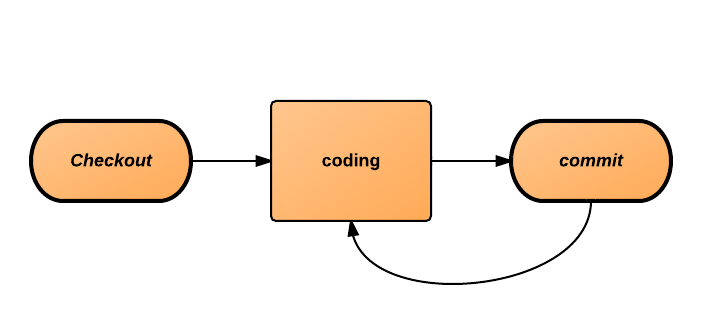
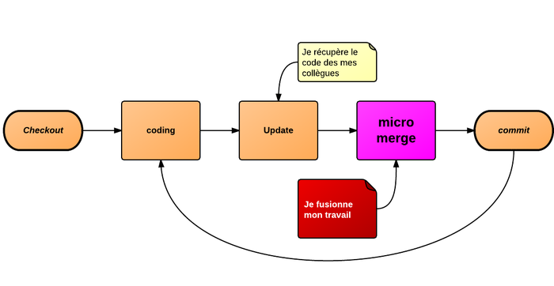
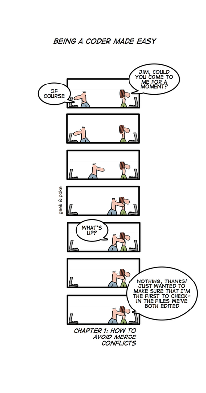

!SLIDE

# Question</question>
## Cela vous est il arrivé ?

!SLIDE

# D&#39;ou venait le problème ?

!SLIDE center

!SLIDE center

!SLIDE

# Quelle est la raison ?

!SLIDE

# Plus c&#39;est gros, plus c&#39;est **difficile** de merger

!SLIDE

# D&#39;ou les commits **fréquents**

!SLIDE bullets

# Conséquence, du code...

* non testé
* non fini
* non validé
* non documenté 

!SLIDE

# **Micro Merge** permanent 

!SLIDE code

$ hg log

changeset:   14:810541a2f324
user:        développeur C
summary:     request fails on field rd_count -> need to be corrected in storage

changeset:   13:23f18c61555d
user:        développeur C
summary:     completed request with more fields from database

changeset:   12:a346955a7bea
user:        développeur B
summary:     changed showed columns in tcp form

changeset:   11:ed523c89c06d
user:        développeur C
summary:     typo

changeset:   10:cab8f7d2a2d6
user:        développeur C
summary:     added column ip dest

changeset:   9:57a90167ec43
user:        développeur A
summary:     gui writes service instead of footprint

changeset:   8:20b71148b377
user:        développeur A
summary:     gui request service instead of footprint

changeset:   7:08a85b1e5a5e
user:        développeur A
summary:     typo

changeset:   6:b7e8b8fd078d
user:        développeur B
summary:     add kss rules

changeset:   5:97b92ab5d366
user:        développeur A
summary:     add zone dst in tcp.html page

!SLIDE center

!SLIDE center

!SLIDE

# Pour conséquence

!SLIDE center

!SLIDE

# Et les branches SVN ?

!SLIDE center

!SLIDE center

!SLIDE center

!SLIDE

# Question</question>
## Qui aime merger des branches SVN ?

!SLIDE

# SVN **traumatise**
## On est *arrivé à dire* que les branches causent **toujours** des problèmes

!SLIDE

# Pourquoi ?

!SLIDE

## Exemple AngularJS

<input ng-model="qui">
Hello {{qui}}!

<pre class="code prettyprint">
&lt;input ng-model="qui">
&lt;span>Hello {{qui}}!&lt;/span>
</pre>

{{1+1}}

<pre class="code prettyprint">
class Voila {
public:
  // Voila
  static const string VOILA = "Voila";

  // will not interfere with embedded tags.
}
</pre>

!SLIDE 

# Il est trés facile de faire des branches...

!SLIDE

# Mais c&#39;est un **cauchemar** pour merger

!SLIDE center

## Houston nous avons un problème !

!SLIDE

# Nous utilisons un outil de gestion de source...

!SLIDE

# ...mais sans les fonctionnalités associées

!SLIDE

# C&#39;est un gestionnaire d&#39;historique (copie évoluée)

!SLIDE center

!SLIDE

# Objectif à atteindre :
## Livrer **régulièrement** de la valeur
### (si possible en étant toujours stable)

!SLIDE bullets

# Ce qui signifie **connaitre** l&#39;état du projet
### (idéalement supprimer le passage dev -> livraison)

!SLIDE

# Le moyen clé :
# **isolation**
